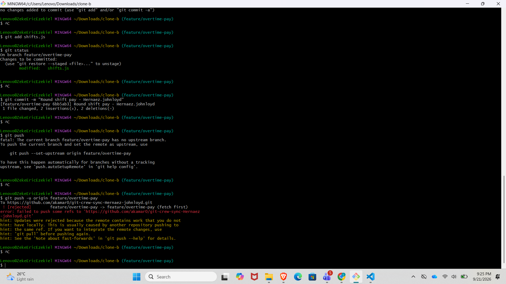
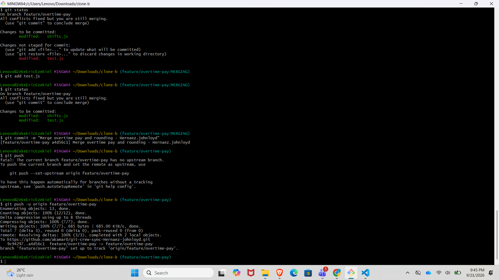
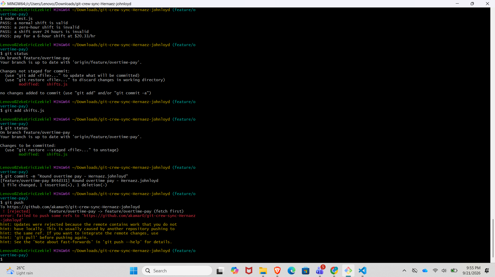
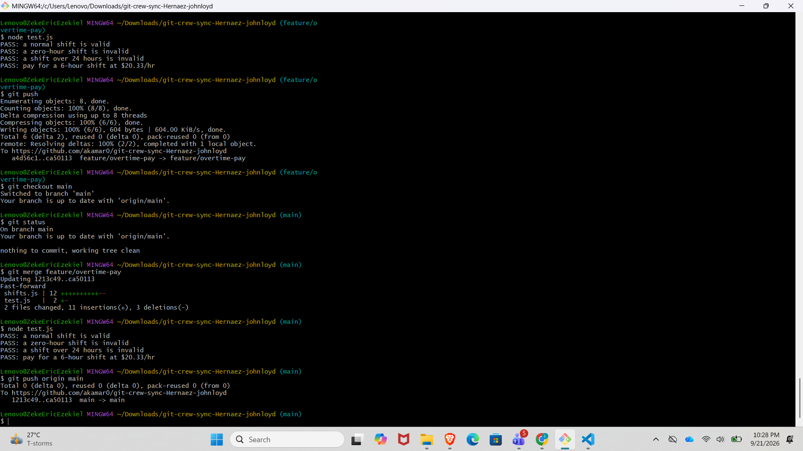
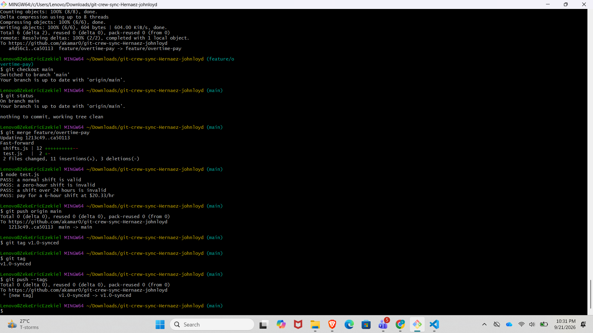

# Git Crew Sync Workflow

## Task 1 — Push a change from Clone A

Clone A added overtime pay for shifts longer than 8 hours. Overtime hours are paid at 1.5 times the regular hourly rate.

The change was committed and successfully pushed to the `feature/overtime-pay` branch.

---

## Task 2 — Diverge from Clone B and get rejected

Clone B made a different change to the same `calculatePay()` function by changing the calculation from truncating the result with `Math.floor()` to rounding it with `Math.round()`.

When Clone B tried to push, Git rejected the push because the remote `feature/overtime-pay` branch already contained a commit from Clone A that Clone B did not have locally.

The rejection happened because the two clones had diverged from the same branch.

---

## Task 3 — Reconcile with a merge

In Task 3, Clone B first fetched the changes from the remote repository and then merged `origin/feature/overtime-pay`.

Git detected a conflict in `shifts.js` because both clones had changed the same `calculatePay()` function.

I manually resolved the conflict so that both behaviors remained: overtime pay at 1.5 times the regular rate and rounded pay.

After resolving the conflict, the tests passed and the merge result was pushed successfully.

---

## Task 4 — Reconcile with a rebase

In Task 4, Clone A made another change to `calculatePay()` without fetching the latest remote changes first. The push was rejected again because the remote branch contained commits that Clone A did not have locally.

Instead of merging this time, I fetched the remote changes and used:

`git rebase origin/feature/overtime-pay`

The rebase produced a conflict in `shifts.js`. I resolved the conflict manually, staged the file, and continued the rebase with:

`git rebase --continue`

The rebase completed successfully. The tests passed, and the branch was pushed normally without using force push.

---

## Task 5 — Merge into main

After finishing the feature branch, I switched to `main` and merged `feature/overtime-pay` into it.

The merge was a fast-forward merge because `main` had not received any new commits since the feature branch was created.

The tests passed on `main`, and I pushed the updated `main` branch to GitHub.

---

## Task 6 — Tag the final version

The final commit was tagged as:

`v1.0-synced`

The tag was pushed to GitHub using:

`git push --tags`

The tag is visible on the GitHub repository.

---

# Reflection Questions

## 1. What did the rejected push error message tell you, and why did it happen?

The rejected push message told me that the remote repository contained work that I did not have locally. This happened because another clone had already pushed changes to the same branch. My local branch was therefore behind the remote branch, so Git prevented me from pushing over the remote history.

## 2. What's the actual difference between how you resolved Task 3 (merge) vs Task 4 (rebase)?

In Task 3, I used a merge to combine the changes from Clone A and Clone B. Git created a merge commit after I manually resolved the conflict.

In Task 4, I used rebase instead. Git replayed my local commit on top of the updated remote branch. I had to resolve a conflict during the rebase and then continue the rebase. The result produced a more linear history.

## 3. What one habit would have avoided both rejected pushes?

A good habit would be to fetch or pull the latest changes from the remote branch before starting work or pushing changes. This helps me know whether someone else has already pushed changes to the same branch.

## 4. Which approach — merge or rebase — would you default to on a shared team branch, and why?

I would default to merge on a shared team branch because it preserves the existing branch history and does not require rewriting commits that other team members may already have. Rebase can be useful when working on a personal feature branch when a cleaner linear history is desired.